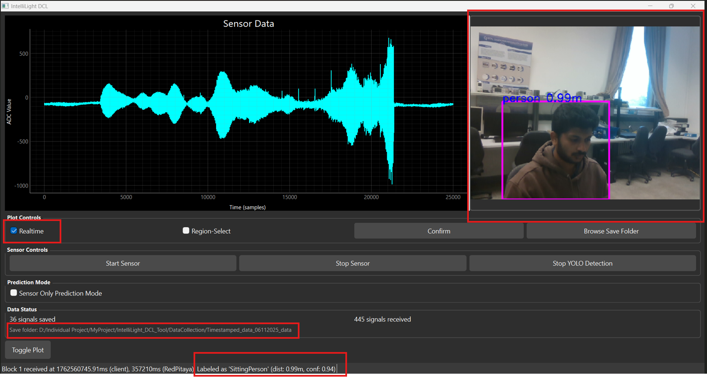
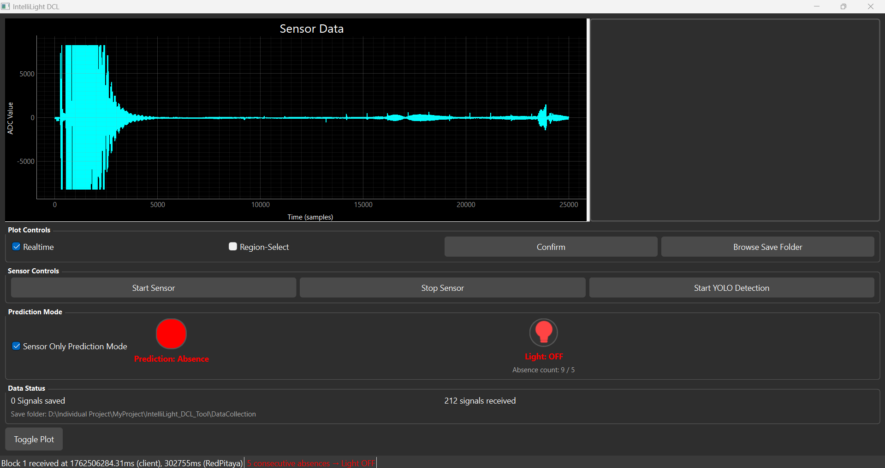
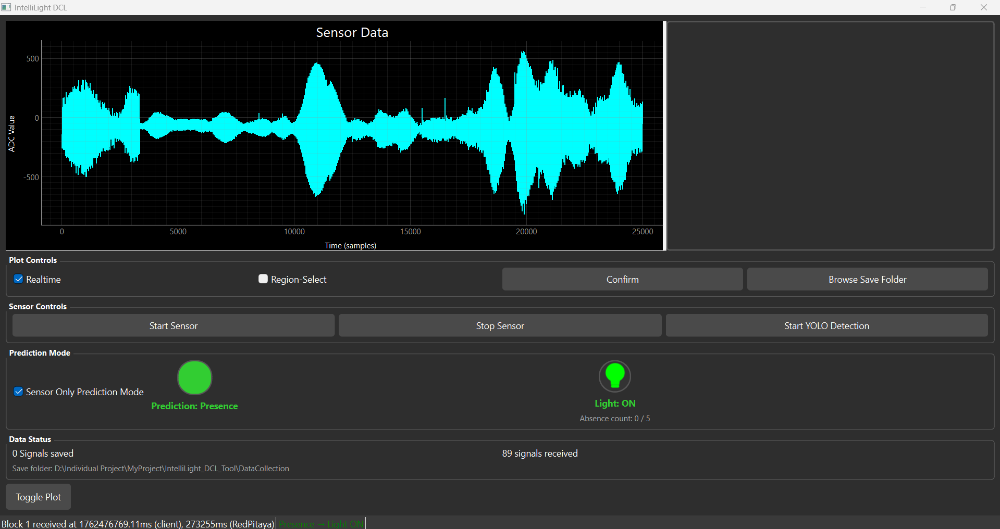
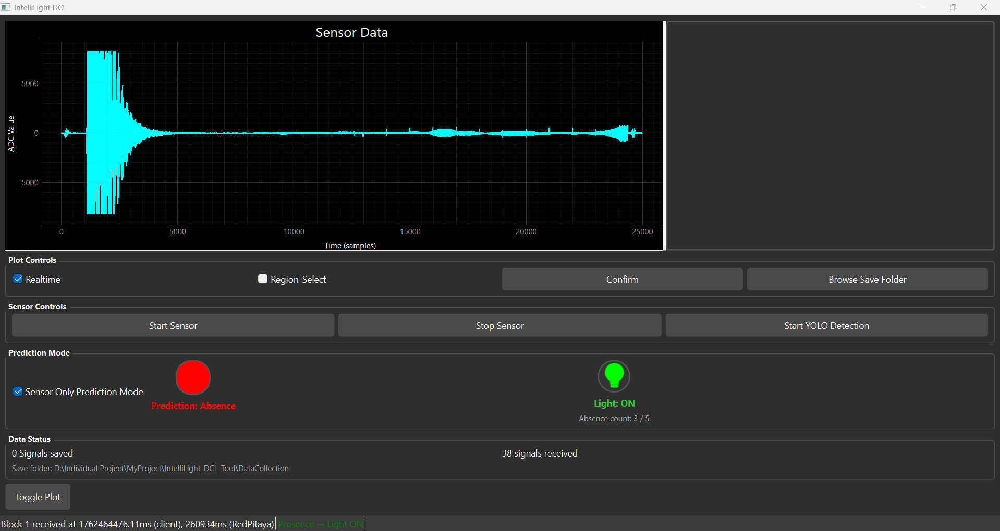

# IntelliLight DCL Tool

IntelliLight DCL (Data Collection & Lighting Control Tool) is a software application that collects ultrasonic sensor data from RedPitaya and optionally uses YOLO-based camera detection to label that data.  
It also includes a **Sensor-Only Prediction Mode** that can automatically detect human presence and intelligently control lighting.

---

## Features
- Live ultrasonic sensor plot from RedPitaya
- YOLO-based real-time person detection (optional camera mode)
- Automatic data labeling and CSV saving
- Sensor-only presence prediction using trained ML model
- Smart Light ON/OFF logic during prediction mode

---


## Requirements

**Hardware**
- RedPitaya board (UDP streaming enabled)
- Ultrasonic sensor (Connected to RedPitaya )
- (Optional) Camera (e.g., RealSense)
- Windows PC

**Software**
- Python 3.9 – 3.12
- Visual Studio Code recommended

---


## Installation

```bash
git clone https://github.com/<your-username>/IntelliLight-DCL-Tool.git
cd IntelliLight-DCL-Tool
````

Create virtual environment:

```bash
python -m venv venv
```

Activate environment:

```bash
.\venv\Scripts\activate
```

Install dependencies:

```bash
python -m pip install -r requirements.txt
```

---

## Running the Application

```bash
python IntelliLight_DCL.py
```

---

# MODE 1 — **DATA COLLECTION MODE**

This mode is used when you want to **record and label sensor data**.

Below is the UI preview of IntelliLight DCL Tool in Data Collection mode



### **Steps:**

#### 1️. **Start Sensor**
- Click the **Start Sensor** button  
The app will connect to RedPitaya and start streaming ultrasonic data.

#### 2️. **Enable Real-Time Plotting**
- Check the **Realtime** checkbox  
You will now see live waveform data from the sensor.

#### 3️. **Start YOLO Detection**
- Click **Start YOLO Detection**  
The camera feed appears on the right side.

Now the tool will:
- Detect person / movement / object using the camera
- Match the nearest sensor signal in time
- **Automatically save and label the signal**

#### **Saved Data Folder Structure**
```
DataCollection/
    Person/
    MovingPerson/
    SittingPerson/
    StandingPerson/
    Object/
    Doubt/
```

Each saved file is a `.csv` containing raw ADC values.

```
YYYYMMDD_HHMMSS_microsec.csv
```

---


# MODE 2 — **SENSOR-ONLY PREDICTION MODE**

This mode works **without any camera**.  
It uses a **trained machine learning model** to detect presence just from ultrasonic signal patterns.

### **Steps:**

#### 1️. **Enable Prediction Mode**
- Check the **Sensor Only Prediction Mode** checkbox  
The ML model loads automatically.

#### 2️. **Turn On Real-Time Streaming**
- Check **Realtime** checkbox  
Sensor data will start streaming live.

#### What Happens Now:
| State | Indicator | Light Status |
|------|-----------|--------------|
| Presence detected | Green circle | Light turns **ON** |
| No presence (for few seconds) | Red circle | Light turns **OFF** |

---

Reference output screenshots:

You will see:
- **A circular indicator** showing presence/absence
- **Light ON/OFF status below it**


### Prediction output indicating absence; the light state is OFF.


--- 

### Prediction output indicating presence; the light state is ON.


---

### Absence predicted, but light remains ON since the absence counter has not exceeded the defined threshold.



---

## Quick Summary

| Feature | Mode | Camera Needed? | Purpose |
|--------|------|----------------|---------|
| Data Collection | Mode 1 |  Yes | Collect & label training data |
| Real-time Prediction | Mode 2 |  No | Detect presence & control light |

---

## Folder Overview

```
IntelliLight_DCL_Tool/
│   IntelliLight_DCL.py
│   camera_detection_test.py
│   requirements.txt
│   README.md
│   RF_Model_Training.ipynb
├── DataCollection/      ← Saved labeled sensor data
├── TrainedModels/       ← ML model (.pkl file)
└── venv/                ← Virtual environment (not uploaded)
```

---

## Author
**Anushruthpal Keshavathi Jayapal**


